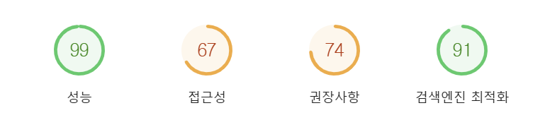
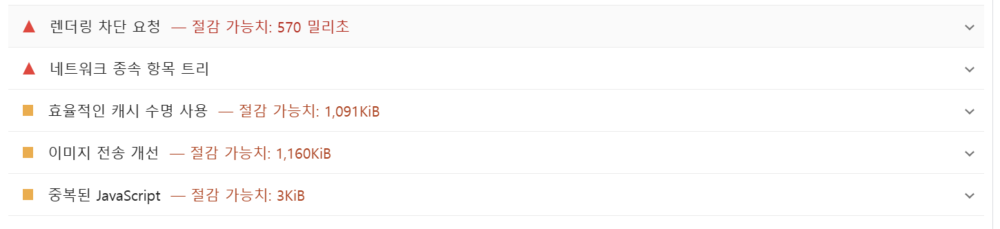
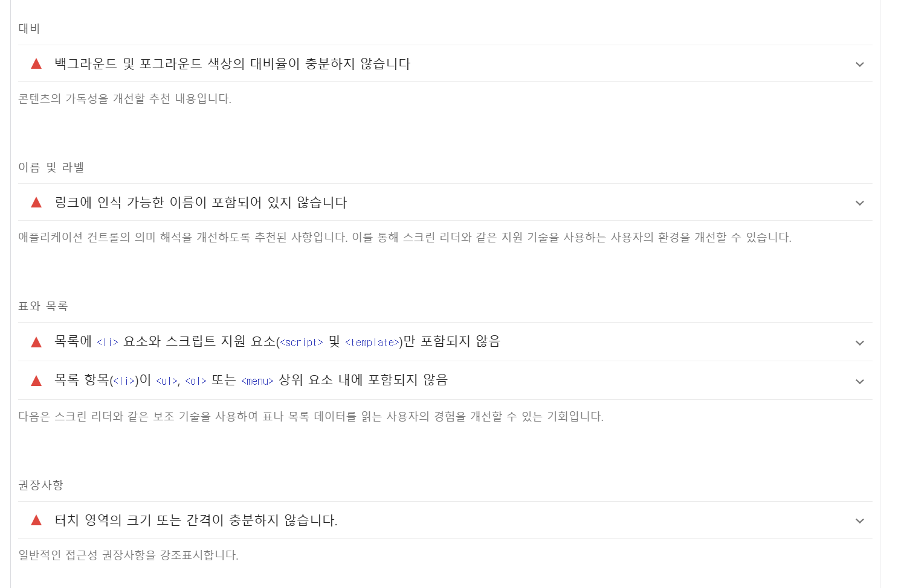
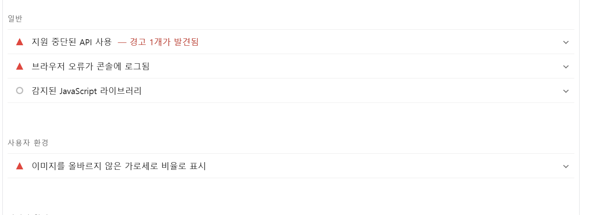
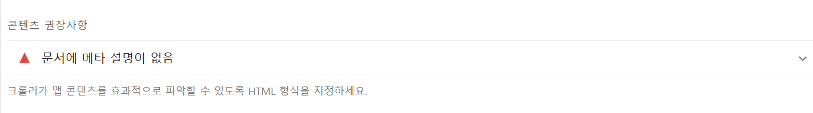

# Profile_page
김현진의 프로필 홈페이지입니다.

# 렌더링 최적화

->Github actions를 사용한 배포라 프론트 단에서 할 수 있는 최적화를 진행해보았다.

📌 목표 : LCP 최적화

- 개선을 진행하기 전 수치

은근 괜찮게 나왔지만 개선할 점이 몇 가지(?) 있을꺼 같다.

~~문제가 거의 firebase api를 사용하면서 나온거 같다..~~

- 개선 사항
    1. nav에서 ul 안에 li를 넣어야 하는데 반대로 했다.. 수정 완료
    2. meta 데이터 간략하게 추가 완료
    3. a 태그 라벨링 완료
    4. js에 defer와 async를 추가해줬다..